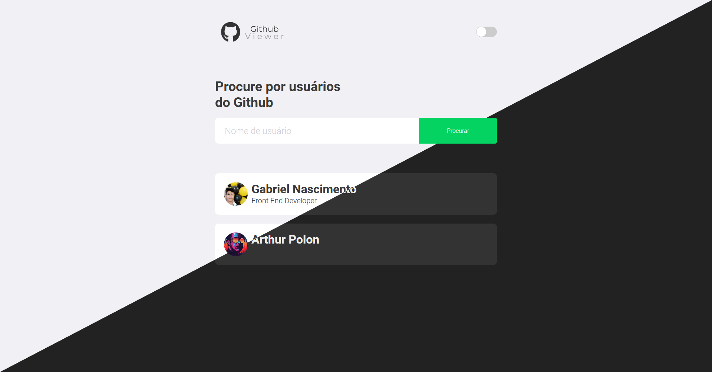
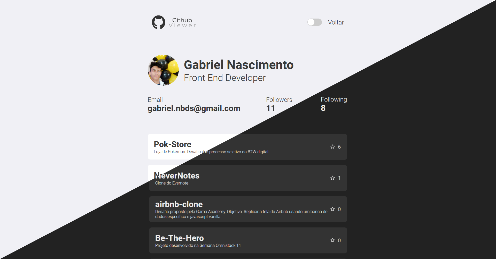

  

<h1 align="center">Github Viewer</h1>

<h2 align="center">Link para live demo <a href="https://github-viewer.now.sh/">aqui</a>.
<h2 align="center">Link para o design no figma <a href="https://www.figma.com/file/dwiN6v5TpocxyOZzDL39lj/Github-viewer?node-id=0%3A1">aqui</a>.

# Sumário

1. [O Que é?](#o-que-é)
2. [User Stories](#user-stories)
3. [Tecnologias usadas](#tecnologias-usadas)
4. [Screenshot](#screenshot)
5. [Como rodar localmente](#como-rodar-localmente)
6. [Informações extras](#informações-extras)

# O que é?

O Github Viewer é o projeto que desenvolvi no processo seletivo da <a href="https://cosmobots.io/">CosmoBots</a>. O objetivo do desafio era implementar uma aplicação client-side, que consulte a API do GitHub e mostre os repositórios de um determinado usuário

# User Stories

-   [x] Deve existir uma página com campo de pesquisa por @ de um usuário do GitHub.

-   [x] Ao buscar um usuário pelo login do github, direcionar para pagina de resultado de busca.

-   [x] Se o usuário for encontrado apresentar uma pagina de detalhes do usuário, com seus repositórios e informações; caso contrario exibir mensagem amigável de erro.

-   [x] Eu, como usuário, desejo buscar por um usuário do GitHub.

-   [x] Eu, como usuário, desejo ver os detalhes desse usuário que foi buscado (número de seguidores, número de seguidos, imagem do avatar, e-mail e bio).

-   [x] Eu, como usuário, desejo ver a listagem dos repositórios desse usuário que foi buscado, ordenados pelo número decrescente de estrelas.

-   [x] É obrigatório o uso de rotas.

# Tecnologias usadas

- Typescript
- ReactJS
- React Router Dom
- Context API (React Hooks)
- Styled Components (CSS in JS)
- Axios (HTTP Client)
- Prettier
- ESLint (air-bnb style guide)
- EditorConfig
- Vercel (Deploy)

# Screenshot

  

  

# Como rodar localmente

- Rode `npm install` no terminal dentro da pasta `ghviewer`.
- Ainda dentro de `ghviewer`, rode `npm run start` e o navegador irá iniciar executando o projeto em `localhost:3000`.

obs: Necessário ter o NodeJS instalado.

# Informações extras

- A Context API foi utilizada exclusivamente para salvar o tema atual da aplicação (light ou dark).

- Para adicionar mais opções de cores para o theme switcher, além de editar os arquivos em `./ghviewer/src/styles/themes`, também é necessário modificar a declaração de tipos em `./ghviewer/src/styles/styled.d.ts `.

- O `usePersistedState` em `./src/utils` serve exclusivamente para salvar o tema atual no localStorage.
